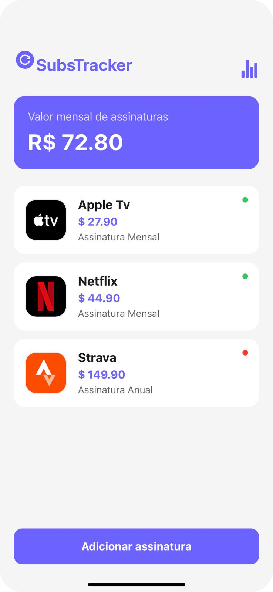
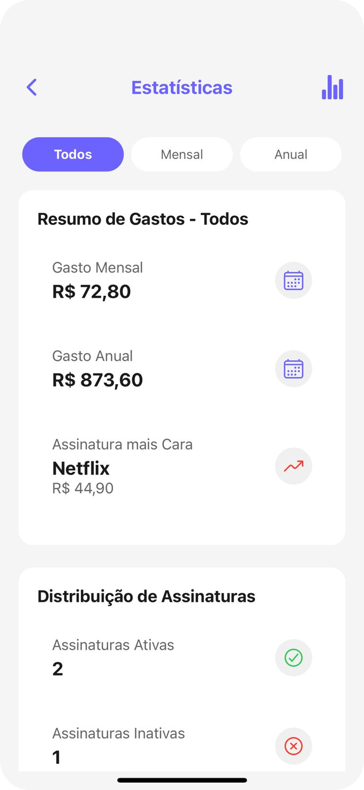
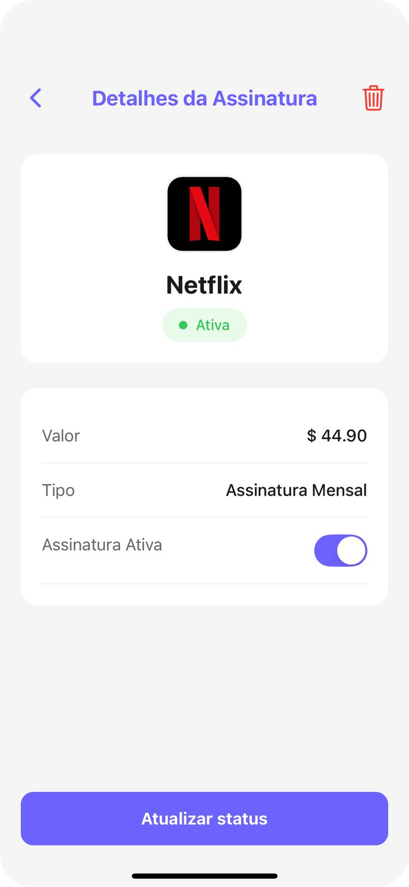

# 📱 SubsTracker

**SubsTracker** é um aplicativo mobile para **controle de assinaturas de streaming e serviços recorrentes**, ajudando o usuário a entender quanto está gastando mensal e anualmente, quais assinaturas estão ativas e quais podem ser canceladas.

A proposta é simples: **visualização clara, controle fácil e menos dinheiro indo embora sem você perceber**.

---

## ✨ Funcionalidades

- 📊 **Resumo financeiro**
  - Gasto mensal total
  - Gasto anual estimado
  - Assinatura mais cara

- 🔍 **Detalhes da assinatura**
  - Valor
  - Tipo (mensal ou anual)
  - Status (ativa ou inativa)
  - Atualização rápida de status

- 📋 **Lista de assinaturas**
  - Visualização clara de todas as assinaturas
  - Identificação visual de assinaturas ativas e inativas

- ➕ **Gerenciamento**
  - Adicionar novas assinaturas
  - Ativar ou desativar serviços facilmente

---

## 📸 Telas do App

  
  
  

---

## 🧠 Motivação

Muitas pessoas assinam diversos serviços (streaming, apps, plataformas) e acabam perdendo o controle dos gastos recorrentes.

O **SubsTracker** nasceu para resolver exatamente isso:
> *“Você sabe quanto gasta por mês com assinaturas?”*

---

## 🛠️ Tecnologias

> _(Ajuste conforme sua stack real)_

- 📱 Mobile App
- ⚛️ React Native
- 🎨 UI focada em clareza e usabilidade
- 📦 Armazenamento local para dados do usuário

---

## 🚀 Roadmap (ideias futuras)

- 🔔 Lembretes de renovação
- 📅 Integração com calendário
- 📈 Histórico de gastos
- ☁️ Backup em nuvem
- 🔐 Autenticação de usuário

---

## 🤝 Contribuição

Contribuições são bem-vindas!  
Sinta-se à vontade para abrir **issues**, **pull requests** ou sugerir melhorias.

---

## 📄 Licença

Este projeto está sob a licença MIT.  
Veja o arquivo [LICENSE](LICENSE) para mais detalhes.

---

Feito com ❤️ para ajudar a manter as finanças sob controle.
